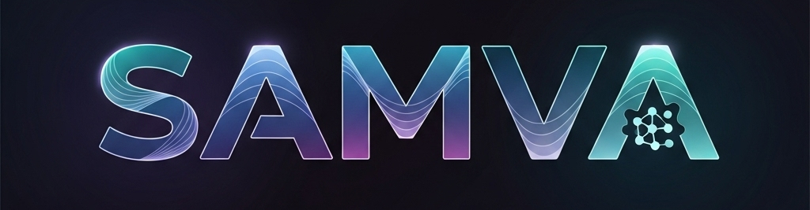

# Samva 🗣️

**Samva** (संवाद) is a MERN stack project that brings **AI-powered conversations** to life.  
It uses a **Generative AI API** to provide intelligent, text-based responses — just like chatting with a smart companion.

🌐 **Live Demo:** [https://samva.onrender.com](https://samva.onrender.com)

---

## 🚀 Features

- 💬 **Text-based conversation** with Generative AI (current).
- 🔊 Future plans: **Voice support** for natural conversations.
- 🖼️ Future plans: **Image and document sharing** for richer interactions.
- 🌐 Built with the **MERN Stack** (MongoDB, Express, React, Node.js).

---

## 🎯 Vision

Samva aims to be more than just a chatbot.  
It’s a **Nepali-inspired digital companion**, designed to make conversations with AI feel natural, friendly, and accessible — whether through text, voice, or media.

---

## 🛠️ Tech Stack

- **Frontend:** React + Tailwind (UI)
- **Backend:** Node.js + Express
- **Database:** MongoDB
- **AI Integration:** Generative AI API

---

## 📌 Roadmap

- [x] Text-based conversation
- [ ] Voice conversation support
- [ ] Photo & document understanding
- [x] Improved multi-turn conversation memory

---

## 🤝 Contributing

Contributions are welcome! Feel free to open issues and pull requests.

---

## 📜 License

This project is licensed under the MIT License.
